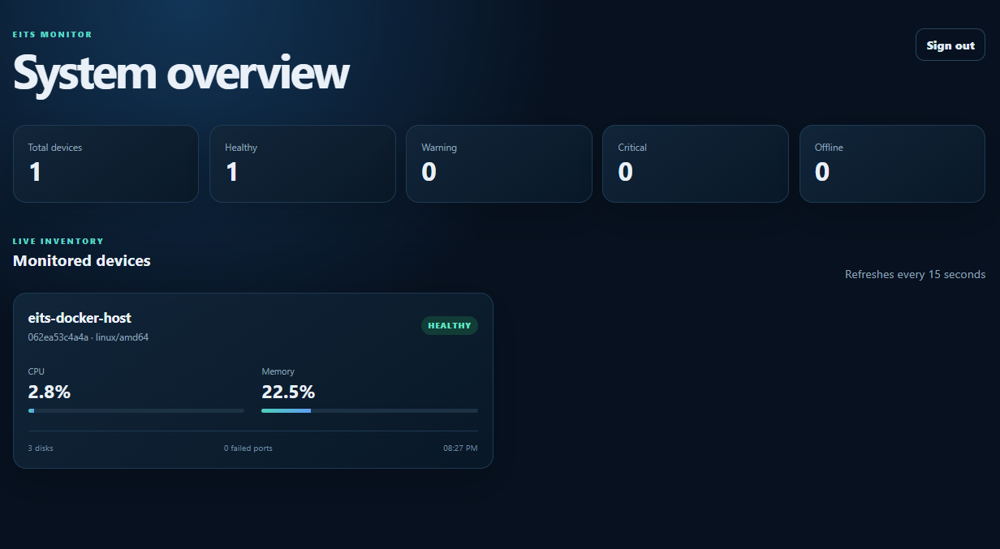
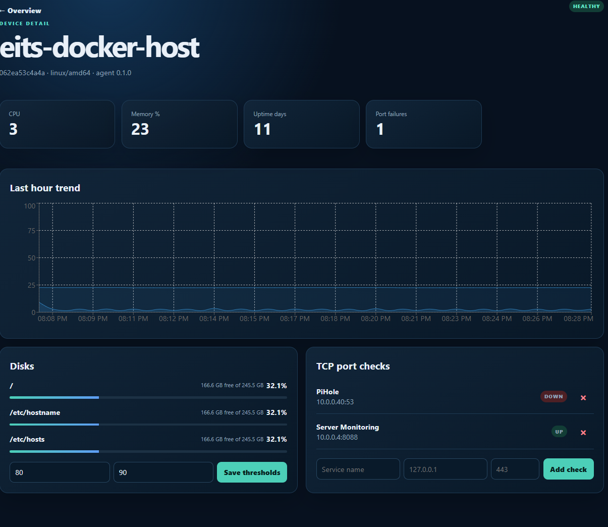

# EITS Monitor

> [!WARNING]
> **Alpha software.** EITS Monitor is intended for home labs, test environments, and community evaluation. Breaking changes may occur, and the project has not undergone an external security audit.

EITS Monitor is a lightweight, self-hosted infrastructure monitoring platform with a responsive web dashboard and cross-platform agents. It monitors host resources, disk capacity, uptime, and configurable TCP/UDP endpoints without exposing inbound agent ports.

## Current features

- Docker Compose deployment for the server stack
- FastAPI backend and PostgreSQL database
- React and TypeScript responsive dashboard
- Docker-host monitoring agent
- Native Windows, Linux AMD64, and Linux ARM64 agents
- Modern .NET 8 WPF Windows Agent Manager with system-tray support
- Native Windows Service integration with console-free controls
- Secure Windows connection management with health checks, enrollment verification, and rollback
- Server removal with associated monitoring-history cleanup
- Searchable and paginated network checks
- Running-process inventory and selected process availability monitoring
- CPU, memory, disk, uptime, and basic network metrics
- Configurable disk warning and critical thresholds
- TCP and UDP endpoint checks
- Per-device enrollment credentials
- Metric history and device health states
- Smartphone-friendly interface

## Screenshots





## Architecture

```text
Windows / Linux agents -- HTTPS/HTTP API -- FastAPI -- PostgreSQL
Docker host agent -----------|                  |
                                                +-- React/Nginx UI
```

Agents initiate outbound communication only. They enroll once using a temporary enrollment token and then use a unique device credential.

## Quick start

### Requirements

- Linux host with Docker Engine and Docker Compose v2
- 2 GB RAM minimum for a small test deployment
- A modern browser

### 1. Configure

```bash
cp .env.example .env
```

Generate secrets:

```bash
openssl rand -hex 64
openssl rand -hex 32
openssl rand -hex 24
```

Edit `.env` and replace every placeholder value.

### 2. Start

```bash
docker compose up -d --build
```

Open `http://SERVER-IP:8088` in a browser.

### 3. Check status

```bash
docker compose ps
docker compose logs --tail=100 api agent web
```

## Native agents

The portable Go collection engine and packaging resources are under [`native-agent/`](native-agent/). The Windows desktop, service host, and privileged control helper are under [`windows-agent/`](windows-agent/).

Supported targets:

- Windows AMD64
- Linux AMD64
- Linux ARM64

### Windows Agent Manager

The Windows package uses a hybrid design:

- `Eits.Agent.Manager.exe`: responsive .NET 8 WPF interface and system tray
- `Eits.Agent.Service.exe`: automatic Windows Service host
- `Eits.Agent.Control.exe`: elevated, console-free service and connection helper
- `eits-agent-engine.exe`: portable Go metrics and server-transport engine

Closing the Manager hides it in the notification area and does not stop monitoring. Only one Manager instance can run at a time. Service operations execute asynchronously through native Windows APIs, so no PowerShell or black console windows appear during normal use.

The **Change connection** option accepts a server URL, enrollment token, device name, and trusted-network HTTP setting. It validates server health, protects the token from command-line exposure, waits for enrollment, and restores the previous configuration if reconnection fails.

Build the Windows solution:

```powershell
dotnet build .\windows-agent\Eits.Agent.Windows.sln -c Release
```

Build self-contained Windows applications and the other agent targets:

```powershell
cd native-agent
.\scripts\build.ps1
```

Windows clients do not require a separate .NET installation because release packages are self-contained. Use the `EITS-Agent-Setup-vX.Y.Z.exe` artifact from GitHub Releases for installation and upgrades.

### Legacy PowerShell installation

The script-based installer remains available for development and recovery. Run PowerShell as Administrator:

```powershell
Set-ExecutionPolicy -Scope Process Bypass

.\install-agent.ps1 `
  -ServerUrl "https://monitor.example.com" `
  -EnrollmentToken "YOUR_ENROLLMENT_TOKEN" `
  -DeviceName "SERVER-WIN01"
```

For isolated HTTP testing only, add `-AllowInsecureHttp`.

### Linux installation

```bash
sudo ./install-agent.sh \
  https://monitor.example.com \
  YOUR_ENROLLMENT_TOKEN \
  SERVER-LINUX01
```

## TCP and UDP checks

TCP checks confirm that a connection can be established.

Generic UDP checks have inherent limitations because UDP has no connection handshake. A UDP send without a response can confirm only that the datagram was sent without an immediate local error. Enable **Require response** when the service returns a known response. Protocol-specific DNS, NTP, and SNMP probes are planned.

## Security notes

- Use HTTPS for production deployments.
- Rotate enrollment tokens periodically.
- Never commit `.env`, agent configuration, identity files, database dumps, or private keys.
- The Docker host agent mounts host resources read-only and should be treated as trusted infrastructure.
- EITS Monitor does not provide arbitrary remote-command execution.

Read [`SECURITY.md`](SECURITY.md) before exposing the application outside a trusted network.

## Documentation

- [Architecture](docs/architecture.md)
- [Agent guide](docs/agents.md)
- [Windows agent guide](docs/windows-agent.md)
- [Windows solution](windows-agent/README.md)
- [Troubleshooting](docs/troubleshooting.md)
- [Roadmap](ROADMAP.md)
- [Contributing](CONTRIBUTING.md)

## Release status

Current Windows and portable-agent release: **v0.5.0-alpha.11**

The redesigned .NET 8 Windows Agent Manager is available on `main` and is being prepared for the next prerelease. Agent update controls are intentionally reserved for a later release.

See [`CHANGELOG.md`](CHANGELOG.md).

## License

Licensed under the Apache License 2.0. See [`LICENSE`](LICENSE).
