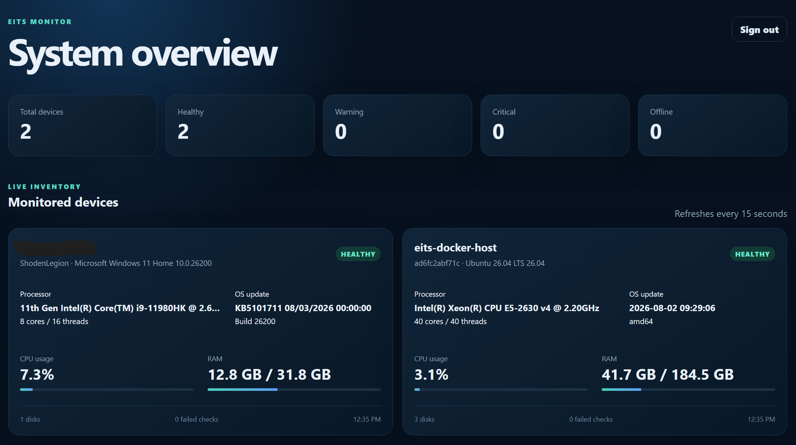
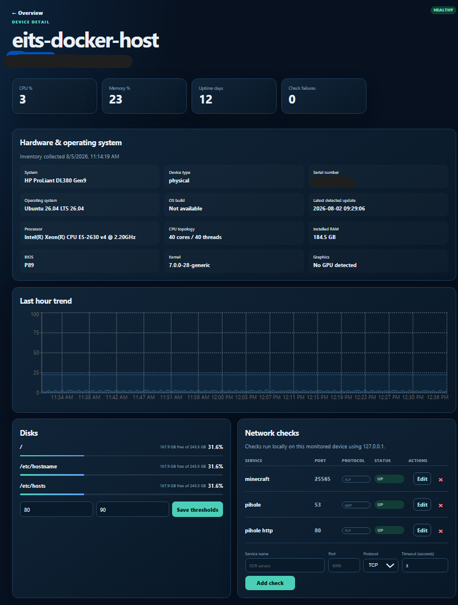

# EITS Monitor

> [!WARNING]
> **Alpha software.** EITS Monitor is intended for home labs, test environments, and community evaluation. Breaking changes may occur, and the project has not undergone an external security audit.

EITS Monitor is a lightweight, self-hosted infrastructure monitoring platform with a responsive web dashboard and cross-platform agents. It monitors host resources, disk capacity, uptime, and configurable TCP/UDP endpoints without exposing inbound agent ports.

## Current features

- Docker Compose deployment for the server stack
- FastAPI backend and PostgreSQL database
- React and TypeScript responsive dashboard
- Docker-host monitoring agent
- Native Windows, Linux AMD64, and Linux ARM64 agents
- Modern .NET 8 WPF Windows Agent Manager with system-tray support
- Native Windows Service integration with console-free controls
- Secure Windows connection management with health checks, enrollment verification, and rollback
- Server removal with associated monitoring-history cleanup
- Searchable and paginated network checks
- Running-process inventory and selected process availability monitoring
- CPU, memory, disk, uptime, and basic network metrics
- Configurable disk warning and critical thresholds
- TCP and UDP endpoint checks
- Per-device enrollment credentials
- Metric history and device health states
- Explainable Warning and Critical states driven by disks, network checks, monitored processes, and agent availability
- Smartphone-friendly interface

## Screenshots

### System overview

Live device health, hardware summaries, utilization, and last-report status from the monitored environment.



### Device monitoring

Detailed hardware inventory, utilization history, disks, thresholds, and TCP/UDP network checks.



### Windows Agent Command Center

The Windows agent includes a branded dark interface, live service and registration status, connection management, service controls, diagnostics, and system-tray operation.

<p align="center">
  
</p>

## Architecture

```text
Windows / Linux agents -- HTTPS/HTTP API -- FastAPI -- PostgreSQL
Docker host agent -----------|                  |
                                                +-- React/Nginx UI
```

Agents initiate outbound communication only. They enroll once using a temporary enrollment token and then use a unique device credential.

## Quick start

### Requirements

- Linux host with Docker Engine and Docker Compose v2
- 2 GB RAM minimum for a small test deployment
- A modern browser

### 1. Configure

```bash
cp .env.example .env
```

Generate secrets:

```bash
openssl rand -hex 64
openssl rand -hex 32
openssl rand -hex 24
```

Edit `.env` and replace every placeholder value.

### 2. Start

```bash
docker compose up -d --build
```

Open `http://SERVER-IP:8088` in a browser.

### 3. Check status

```bash
docker compose ps
docker compose logs --tail=100 api agent web
```

## Native agents

The portable Go collection engine and packaging resources are under [`native-agent/`](native-agent/). The Windows desktop, service host, and privileged control helper are under [`windows-agent/`](windows-agent/).

Supported targets:

- Windows AMD64
- Linux AMD64
- Linux ARM64

### Install on Windows

The Windows agent is distributed as one self-contained installer. The monitored Windows computer does **not** need PowerShell scripts, .NET, Go, Git, Docker, or a development environment.

The only client-side requirements are a supported 64-bit Windows 10/11 computer, permission to approve the installer’s Windows administrator prompt, network access to the EITS Monitor server, and valid enrollment details.

Before starting, obtain these two values from the EITS Monitor administrator:

- The EITS Monitor server URL, such as `https://monitor.example.com`
- A valid agent enrollment token

Installation:

1. Download [`EITS-Agent-Setup-v0.5.0-alpha.12.exe`](https://github.com/ShodenEvo/eits-monitor/releases/download/v0.5.0-alpha.12/EITS-Agent-Setup-v0.5.0-alpha.12.exe).
2. Open the downloaded installer and approve the standard Windows administrator prompt.
3. Enter the server URL, enrollment token, and the name that should appear on the dashboard.
4. Leave **Allow insecure HTTP** disabled when using HTTPS. Enable it only for an HTTP server on a trusted private network.
5. Select **Install**, then open the Agent Manager when Setup finishes.

Setup installs and starts the `EITSAgent` Windows service automatically. After successful enrollment, the device appears in the dashboard and the temporary enrollment token is removed from the local configuration.

To upgrade, run the newer installer normally. Setup stops the existing agent, waits for its files to be released, installs the update, preserves the enrolled connection and identity, and restarts the service. No manual uninstall is required.

Closing the Agent Manager sends it to the Windows notification area; monitoring continues in the background. To remove the agent, use **Settings > Apps > Installed apps > EITS Monitoring Agent > Uninstall**.

### Windows Agent components

The self-contained Windows package installs:

- `Eits.Agent.Manager.exe`: responsive .NET 8 WPF interface and system tray
- `Eits.Agent.Service.exe`: automatic Windows Service host
- `Eits.Agent.Control.exe`: elevated, console-free service and connection helper
- `eits-agent-engine.exe`: portable Go metrics and server-transport engine

Only one Manager instance can run at a time. Service operations execute asynchronously through native Windows APIs, so no PowerShell or black console windows appear during normal use.

The **Change connection** option accepts a server URL, enrollment token, device name, and trusted-network HTTP setting. It validates server health, protects the token from command-line exposure, waits for enrollment, and restores the previous configuration if reconnection fails.

Developer build instructions are maintained in the [Windows solution guide](windows-agent/README.md) and are not required for normal installation.

### Linux installation

```bash
sudo ./install-agent.sh \
  https://monitor.example.com \
  YOUR_ENROLLMENT_TOKEN \
  SERVER-LINUX01
```

## TCP and UDP checks

TCP checks confirm that a connection can be established.

Generic UDP checks have inherent limitations because UDP has no connection handshake. A UDP send without a response can confirm only that the datagram was sent without an immediate local error. Enable **Require response** when the service returns a known response. Protocol-specific DNS, NTP, and SNMP probes are planned.

## Security notes

- Use HTTPS for production deployments.
- Rotate enrollment tokens periodically.
- Never commit `.env`, agent configuration, identity files, database dumps, or private keys.
- The Docker host agent mounts host resources read-only and should be treated as trusted infrastructure.
- EITS Monitor does not provide arbitrary remote-command execution.

Read [`SECURITY.md`](SECURITY.md) before exposing the application outside a trusted network.

## Documentation

- [Architecture](docs/architecture.md)
- [Agent guide](docs/agents.md)
- [Windows agent guide](docs/windows-agent.md)
- [Windows solution](windows-agent/README.md)
- [Troubleshooting](docs/troubleshooting.md)
- [Roadmap](ROADMAP.md)
- [Contributing](CONTRIBUTING.md)

## Release status

Current Windows and portable-agent release: **[v0.5.0-alpha.12](https://github.com/ShodenEvo/eits-monitor/releases/tag/v0.5.0-alpha.12)**

This release includes the futuristic Windows Agent Command Center, system-tray integration, reliable in-place upgrades, enrollment recovery, service controls, dashboard device removal, searchable network checks, and process monitoring. Agent self-update controls remain reserved for a later release.

See [`CHANGELOG.md`](CHANGELOG.md).

## License

Licensed under the Apache License 2.0. See [`LICENSE`](LICENSE).
